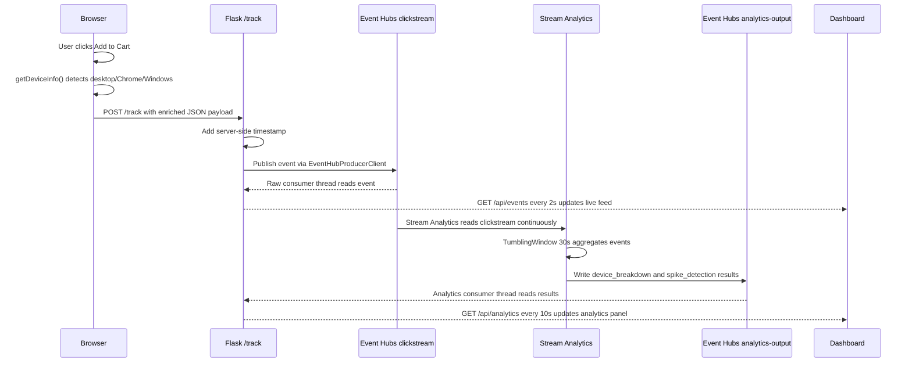

# CST8916 – Assignment 2: Real-time Stream Analytics Pipeline

**Course:** CST8916 – Remote Data and Real-time Applications  
**Semester:** Winter 2026  
**Student:** Divyang  
**Due Date:** March 30, 2026  
**YouTube Demo:** [ADD YOUR YOUTUBE LINK HERE]

---

## What I Built

I extended the Week 10 lab (ShopStream clickstream app) by adding two major features:

1. **Enriched Events** — Every click now includes what device, browser, and operating system the user is on
2. **Stream Analytics Pipeline** — Azure Stream Analytics reads the event stream and answers two real business questions every 30 seconds, with results displayed live on the dashboard

The app is fully deployed on **Azure App Service** and uses **Azure Event Hubs** as the backbone for all real-time data movement.

---

## Architecture Diagram

```mermaid
flowchart LR
    subgraph Browser["🌐 Browser — client.html"]
        Click["User clicks\nproduct / cart / banner"]
        Detect["getDeviceInfo()\ndetects deviceType\nbrowser, os"]
        Track["trackEvent()\nbuilds enriched payload"]
    end

    subgraph Flask["⚙️ Azure App Service — app.py Flask"]
        direction TB
        TrackRoute["/track\nEventHubProducerClient\nadds timestamp"]
        RawConsumer["Raw Consumer Thread\n_on_event()"]
        AnalyticsConsumer["Analytics Consumer Thread\n_on_analytics_event()"]
        EventBuffer["_event_buffer\nlast 50 events"]
        AnalyticsBuffer["_analytics_buffer\ndevice_breakdown\nspike_detection"]
        APIEvents["/api/events"]
        APIAnalytics["/api/analytics"]
    end

    subgraph EH1["☁️ Azure Event Hubs — clickstream"]
        P0["Partition 0"]
        P1["Partition 1"]
    end

    subgraph ASA["☁️ Azure Stream Analytics — shopstream-analytics"]
        Q1["Query 1\nDevice Breakdown\nTumblingWindow 30s"]
        Q2["Query 2\nSpike Detection\nTumblingWindow 30s"]
    end

    subgraph EH2["☁️ Azure Event Hubs — analytics-output"]
        AP0["Partition 0"]
        AP1["Partition 1"]
    end

    subgraph Dashboard["📊 dashboard.html"]
        KPI["KPI Cards"]
        BarChart["Events by Type Chart"]
        Feed["Live Event Feed"]
        DeviceChart["Device Breakdown Chart"]
        SpikeBox["Spike Detection Box"]
    end

    Click --> Detect --> Track
    Track -->|POST /track| TrackRoute
    TrackRoute -->|publish event| EH1
    EH1 --> RawConsumer
    RawConsumer --> EventBuffer
    EventBuffer --> APIEvents
    APIEvents -->|GET every 2s| KPI
    APIEvents --> BarChart
    APIEvents --> Feed

    EH1 -->|reads stream| ASA
    ASA --> Q1
    ASA --> Q2
    Q1 -->|writes results| EH2
    Q2 -->|writes results| EH2
    EH2 --> AnalyticsConsumer
    AnalyticsConsumer --> AnalyticsBuffer
    AnalyticsBuffer --> APIAnalytics
    APIAnalytics -->|GET every 10s| DeviceChart
    APIAnalytics --> SpikeBox

    style Browser fill:#FFF3E0,stroke:#E65100,color:#212121
    style Flask fill:#E3F2FD,stroke:#1565C0,color:#212121
    style EH1 fill:#F3E5F5,stroke:#6A1B9A,color:#212121
    style ASA fill:#E8F5E9,stroke:#2E7D32,color:#212121
    style EH2 fill:#F3E5F5,stroke:#6A1B9A,color:#212121
    style Dashboard fill:#FFF3E0,stroke:#E65100,color:#212121
```



---

## How Data Flows — Step by Step

Here is exactly what happens when a user clicks "Add to Cart":



---

## Azure Resources Used

| Resource | Name | Purpose |
|----------|------|---------|
| Resource Group | `cst8916-week10-rg` | Container for all resources — easy cleanup |
| Event Hubs Namespace | `shopstream-divyang` | Top-level container for both Event Hubs |
| Event Hub | `clickstream` | Receives raw click events from the store |
| Event Hub | `analytics-output` | Receives processed results from Stream Analytics |
| Stream Analytics Job | `shopstream-analytics` | Processes the raw event stream every 30 seconds |
| App Service | `shopstream-divyang` | Hosts the Flask web application on Python 3.11 |

---

## Part 1 — Event Payload Enrichment

### The Problem
The original event payload had no information about what device the user was on:

```json
{
  "event_type": "add_to_cart",
  "page": "/products/shoes",
  "user_id": "u_4a2f"
}
```

This means a query like *"which device types generate the most traffic?"* is impossible to answer.

### The Solution
I added client-side device detection in `client.html` using `navigator.userAgent`. The browser already knows what device it is running on — we just need to read it.

### Enriched Event Payload
Every event now looks like this:

```json
{
  "event_type": "add_to_cart",
  "page": "/products/shoes",
  "product_id": "p_shoe_01",
  "user_id": "u_4a2f",
  "session_id": "s_9b3e",
  "deviceType": "desktop",
  "browser": "Chrome",
  "os": "Windows",
  "timestamp": "2026-03-27T22:46:20.123456+00:00"
}
```

---

## Part 2 — Stream Analytics Queries

### Query 1 — Device Type Breakdown
**Business question:** *"Which device types are most active?"*

```sql
SELECT
    System.Timestamp() AS window_end,
    deviceType,
    COUNT(*) AS event_count,
    'device_breakdown' AS query_type
INTO
    [analytics-output]
FROM
    [clickstream-input] TIMESTAMP BY EventEnqueuedUtcTime
GROUP BY
    deviceType,
    TumblingWindow(second, 30)
```

**What this does in plain English:** Every 30 seconds, it groups all events by device type and counts them. For example: `desktop: 11`, `mobile: 3`. Marketing can use this to decide whether to invest in mobile or desktop campaigns.

### Query 2 — Traffic Spike Detection
**Business question:** *"Are there traffic spikes?"*

```sql
SELECT
    System.Timestamp() AS window_end,
    COUNT(*) AS total_events,
    CASE
        WHEN COUNT(*) > 10 THEN 'spike'
        WHEN COUNT(*) > 5  THEN 'elevated'
        ELSE 'normal'
    END AS traffic_level,
    'spike_detection' AS query_type
INTO
    [analytics-output]
FROM
    [clickstream-input] TIMESTAMP BY EventEnqueuedUtcTime
GROUP BY
    TumblingWindow(second, 30)
```

**What this does in plain English:** Every 30 seconds, it counts ALL events and classifies traffic as:
- 🔴 `spike` — more than 10 events in 30 seconds (could be a flash sale or bot)
- 🟡 `elevated` — more than 5 events (busier than normal)
- 🟢 `normal` — 5 or fewer events (regular baseline traffic)

### Why TumblingWindow?

A **Tumbling Window** groups events into fixed-size, non-overlapping time buckets. Think of it like a 30-second countdown timer — when it ends, it outputs results and immediately starts fresh. This gives clean results with no duplicates and is ideal for a dashboard that refreshes regularly.

---

## Part 3 — Dashboard Integration

The dashboard polls two backend endpoints:

| Endpoint | Poll Frequency | Shows |
|----------|---------------|-------|
| `GET /api/events` | Every 2 seconds | Live event feed, KPI cards, events by type chart |
| `GET /api/analytics` | Every 10 seconds | Device breakdown chart, spike detection box |

The Stream Analytics results panel is highlighted with a blue border and labelled clearly so it is easy to identify during the video demo.

---

## Design Decisions

### Why detect device info on the client side?
The browser has direct access to `navigator.userAgent` — no server-side lookup, no third-party API, no extra cost. It works for every request and adds zero latency.

### Why use a second Event Hub for Stream Analytics output instead of Blob Storage or SQL?
Three reasons:
- **Same pattern** — Flask already consumes Event Hubs using `EventHubConsumerClient`. Using a second hub means no new SDK, no new service, no new concept to learn.
- **Truly real-time** — Results arrive in Flask the moment Stream Analytics writes them. Blob Storage requires polling files; SQL requires a database connection.
- **Free tier friendly** — No extra Azure cost compared to adding Azure SQL Database.

### Why keep a local device breakdown fallback in Flask?
Stream Analytics only outputs results every 30 seconds when the window closes. Between windows, the device chart would be empty. The raw event consumer also counts devices locally as each event arrives — so the chart shows data immediately, and Stream Analytics results update it every 30 seconds with more accurate aggregated data.

### Why use `TIMESTAMP BY EventEnqueuedUtcTime`?
This tells Stream Analytics to use the time the event arrived at Event Hubs as the official event time. This is more reliable than trusting the client timestamp because client device clocks can be wrong, out of sync, or manipulated.

---

## Environment Variables

| Variable | Value | Set Where |
|----------|-------|-----------|
| `EVENT_HUB_CONNECTION_STR` | Full connection string from Shared Access Policies | Azure Portal → App Service → Environment variables |
| `EVENT_HUB_NAME` | `clickstream` | Azure Portal → App Service → Environment variables |
| `ANALYTICS_HUB_NAME` | `analytics-output` | Azure Portal → App Service → Environment variables |

> **Security:** Connection strings are never stored in code or committed to Git. They live only in Azure Application Settings (cloud) and local PowerShell environment variables (local development). The `.gitignore` file excludes `.env` files as a second layer of protection.

---

## Setup Instructions

### Prerequisites
- Python 3.11 installed
- Azure account with the following resources created:
  - Event Hubs Namespace: `shopstream-divyang`
  - Event Hub: `clickstream` (2 partitions, 1 day retention)
  - Event Hub: `analytics-output` (2 partitions, 1 day retention)
  - Stream Analytics Job: `shopstream-analytics` (running)
  - App Service: `shopstream-divyang` (Python 3.11, Linux, Free F1)

### Run Locally on Windows

```powershell
# Step 1 — Clone your fork
git clone https://github.com/Divyang2599/26W_CST8916_Week10-Event-Hubs-Lab.git
cd 26W_CST8916_Week10-Event-Hubs-Lab

# Step 2 — Install dependencies
py -m pip install -r requirements.txt

# Step 3 — Set environment variables (use your actual connection string)
$env:EVENT_HUB_CONNECTION_STR="Endpoint=sb://shopstream-divyang.servicebus.windows.net/;SharedAccessKeyName=RootManageSharedAccessKey;SharedAccessKey=YOUR_KEY_HERE"
$env:EVENT_HUB_NAME="clickstream"
$env:ANALYTICS_HUB_NAME="analytics-output"

# Step 4 — Run the app
py app.py
```

Then open:
- `http://localhost:8000` — Demo store
- `http://localhost:8000/dashboard` — Live analytics dashboard

### Azure Deployment

The app deploys automatically via **GitHub Actions CI/CD**:

1. Push any code change to the `main` branch
2. GitHub Actions automatically builds and deploys to Azure App Service
3. No manual steps needed — the pipeline handles everything

**Azure App Service startup command:**
```
gunicorn --bind 0.0.0.0:8000 app:app
```

---

## Project Structure

```
26W_CST8916_Week10-Event-Hubs-Lab/
├── app.py                          # Flask app — producer + raw consumer + analytics consumer
├── requirements.txt                # Python dependencies (flask, azure-eventhub, gunicorn)
├── .gitignore                      # Excludes secrets and build artifacts
├── README.md                       # This file
├── templates/
│   ├── client.html                 # Demo store — enriched event producer with device detection
│   └── dashboard.html              # Live dashboard — raw events + Stream Analytics results
└── .github/
    └── workflows/
        └── main_shopstream-divyang.yml   # CI/CD pipeline — auto-deploys on push to main
```

---

## AI Disclosure

GitHub Copilot and Claude (Anthropic) were used to assist with:
- Analytics consumer thread structure in `app.py`
- Stream Analytics SAQL query syntax
- JavaScript `navigator.userAgent` parsing for device detection
- Dashboard HTML/CSS layout for the analytics panel

All code has been reviewed, understood, tested, and is fully explainable by the author.

---

## Cleanup — Delete Azure Resources After Grading

To avoid charges after the assignment is graded, delete everything with one command:

```bash
az group delete --name cst8916-week10-rg --yes --no-wait
```

Or in the Azure Portal:
1. Go to **Resource Groups**
2. Click `cst8916-week10-rg`
3. Click **Delete resource group**
4. Type the resource group name to confirm → Click **Delete**

This removes the Event Hubs namespace, Stream Analytics job, App Service, and all associated resources in one step.