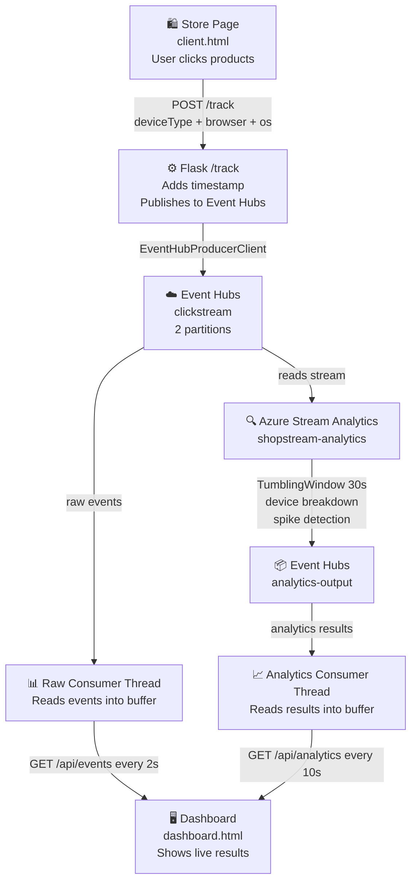

# CST8916 – Assignment 2: Real-time Stream Analytics Pipeline

**Course:** CST8916 – Remote Data and Real-time Applications  
**Student:** Divyang  
**Due Date:** March 30, 2026  
**YouTube Demo:** [https://youtu.be/O1qZcTUYE_0?si=pEBh4aHz5X3YiER-]

---

## Architecture Diagram

This diagram shows how data flows from the store all the way to the dashboard through Stream Analytics.



---

## Design Decisions

### How I enriched the events — Part 1

**Problem:** The original event had no `deviceType`, `browser`, or `os` field. Stream Analytics could not answer *"which devices are most active?"* without this data.

**Decision:** I detected device info **client-side in JavaScript** using `navigator.userAgent`. The browser already knows what device it is running on. Reading it in JavaScript means zero server cost, zero latency, and no third-party service needed.

Every event now carries these extra fields:
```json
{
  "deviceType": "desktop",
  "browser":    "Chrome",
  "os":         "Windows"
}
```

---

### How I connected Stream Analytics output to the dashboard — Part 2

**Problem:** Stream Analytics processes the stream and produces results, but how do those results get to the dashboard?

**Decision:** I created a **second Event Hub** called `analytics-output`. Stream Analytics writes its results there. Flask runs a second background consumer thread that reads from this hub and stores the results in memory. The dashboard polls `/api/analytics` every 10 seconds to get the latest results.

I chose a second Event Hub over Blob Storage or Azure SQL because:
- Flask already knows how to read Event Hubs — same SDK, same pattern, no new service
- Results arrive in real time the moment Stream Analytics writes them
- No extra cost on the student subscription

---

### Stream Analytics Query Design

I used **TumblingWindow(second, 30)**, a fixed 30-second non-overlapping window. Every 30 seconds it outputs fresh results and starts over. This is the right choice for a marketing dashboard where near-real-time updates every 30 seconds are perfectly acceptable.

**Query 1 — Device Breakdown** answers *"Which device types are most active?"*

```sql
SELECT
    System.Timestamp() AS window_end,
    deviceType,
    COUNT(*) AS event_count,
    'device_breakdown' AS query_type
INTO [analytics-output]
FROM [clickstream-input] TIMESTAMP BY EventEnqueuedUtcTime
GROUP BY deviceType, TumblingWindow(second, 30)
```

**Query 2 — Spike Detection** answers *"Are there traffic spikes?"*

```sql
SELECT
    System.Timestamp() AS window_end,
    COUNT(*) AS total_events,
    CASE
        WHEN COUNT(*) > 10 THEN 'spike'
        WHEN COUNT(*) > 5  THEN 'elevated'
        ELSE 'normal'
    END AS traffic_level,
    'spike_detection' AS query_type
INTO [analytics-output]
FROM [clickstream-input] TIMESTAMP BY EventEnqueuedUtcTime
GROUP BY TumblingWindow(second, 30)
```

I used `TIMESTAMP BY EventEnqueuedUtcTime` so Stream Analytics uses the Event Hubs arrival time — more reliable than trusting the client clock.

---

## Setup Instructions

### Azure Resources Needed

| Resource | Name |
|----------|------|
| Event Hubs Namespace | `shopstream-divyang` |
| Event Hub | `clickstream` — 2 partitions, 1 day retention |
| Event Hub | `analytics-output` — 2 partitions, 1 day retention |
| Stream Analytics Job | `shopstream-analytics` — status: Running |
| App Service | `shopstream-divyang` — Python 3.11, Linux, Free F1 |

### Environment Variables

Set these before running — never put secrets in code:

| Variable | Value |
|----------|-------|
| `EVENT_HUB_CONNECTION_STR` | Primary connection string from Shared Access Policies |
| `EVENT_HUB_NAME` | `clickstream` |
| `ANALYTICS_HUB_NAME` | `analytics-output` |

### Run Locally (Windows PowerShell)

```powershell
git clone https://github.com/Divyang2599/26W_CST8916_Week10-Event-Hubs-Lab.git
cd 26W_CST8916_Week10-Event-Hubs-Lab

py -m pip install -r requirements.txt

$env:EVENT_HUB_CONNECTION_STR="Endpoint=sb://shopstream-divyang.servicebus.windows.net/;..."
$env:EVENT_HUB_NAME="clickstream"
$env:ANALYTICS_HUB_NAME="analytics-output"

py app.py
```

Open `http://localhost:8000` for the store  
Open `http://localhost:8000/dashboard` for the live dashboard

### Deploy to Azure

The app deploys automatically via **GitHub Actions CI/CD**.  
Every push to `main` triggers a rebuild and redeploy — no manual steps needed.

Startup command on App Service:
```
gunicorn --bind 0.0.0.0:8000 app:app
```

---

## AI Disclosure

Claude (Anthropic) and GitHub Copilot were used to assist with analytics consumer thread structure, SAQL query syntax, and device detection logic. All code has been reviewed, understood, and tested by the author.

---

## Cleanup

```bash
az group delete --name cst8916-week10-rg --yes --no-wait
```
